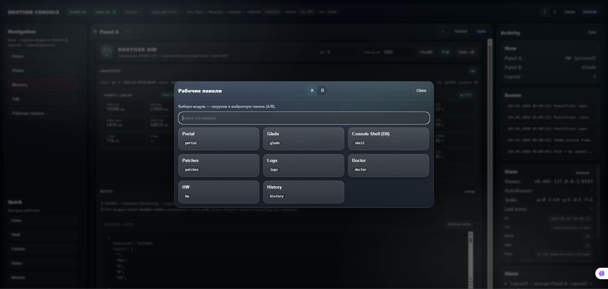
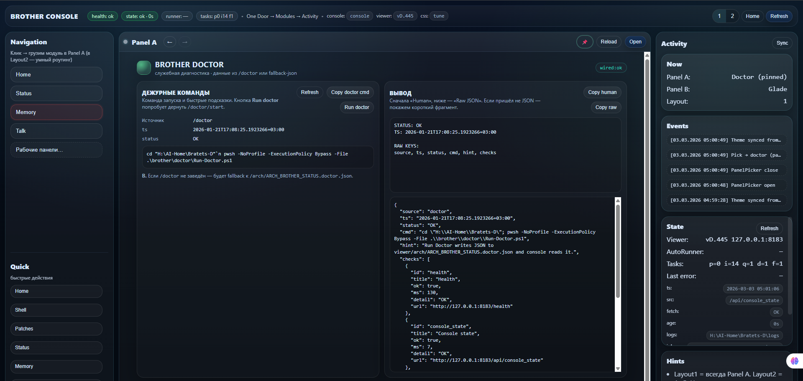

# AI-Home / Bratets-D Console

## One-liner
AI-Home / Bratets-D Console is an operator-led loop that turns endless chat into **verified artifacts** (patches, checks, reproducible results).

## The problem
“Endless chat” produces:
- no artifacts
- no verification
- no reproducibility
- no engineer-friendly handoff

## The solution
An operator-led workflow:
- **Artifacts**: patch / spec / runbook / logs
- **Checks**: smoke / health / version / expected outputs
- **Loop**: request → patch → smoke → result

## What we can contribute
- **Operator loop + packaging**: convert requests into engineer-friendly deliverables (artifacts + checks).
- **Modules & safe actions**: build scoped modules that do real work (safe-by-default, auditable).
- **OpenClaw operator training**: how to drive an agent to produce real modules (not 3-line demos).

## Pilot proposal (1–2 scenarios)
We run a pilot on **1–2 scenarios** and deliver an engineer-friendly package:
- `SPEC.md` (contract, scope, acceptance)
- `PATCH` (PR or FLAT zip)
- `SMOKE.md` (commands + expected outputs)
- `RUNBOOK.md` (operate / rollback / known issues)

## Screens
Console / workflow loop / artifacts:
- 

Smoke / health / version check:
- 

## Demo (optional)
60–90s GIF/video: **request → patch → smoke → result**
- `assets/demo-loop.gif`

## Cases (max 3)
- [Case 001 — Telemetry encoding fix](cases/case-001-telemetry-encoding.md)
- [Case 002 — FLAT patch nesting (404) fix](cases/case-002-flat-patch-nesting.md)
- [Case 003 — Doctor smoke workflow](cases/case-003-doctor-smoke-workflow.md)

## Contact
Email: **s.technik555@gmail.com**

Open to relocation to US if sponsorship/transfer is possible.

Создано Техник & ИИ-агента Curator-555-20260206_175932-r2 · current-24E2
